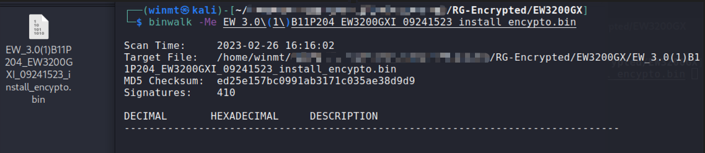

# rg-decrypt

## Description

`rg-decrypt` is a universal firmware decryption tool for `Ruijie Networks`.

The tool is programmed by [@winmt](https://github.com/winmt "https://github.com/winmt"), which is suitable for decrypting lots of encryption firmwares of `Ruijie Networks`(mainly for the firmwares of `Reyee` family, including various routers, wireless APs and switches). 

You can download the latest firmwares here: [https://www.ruijienetworks.com/resources](https://www.ruijienetworks.com/resources "https://www.ruijienetworks.com/resources")

You can also download more firmwares here: [https://www.ruijie.com.cn/fw/rj](https://www.ruijie.com.cn/fw/rj "https://www.ruijie.com.cn/fw/rj")

## Usage

```
sudo cp ./rg-decrypt /usr/bin/rg-decrypt
rg-decrypt [encrypted_firmware_path]
binwalk -Me xxx.decrypted
```

## Example

Download the latest firmware of `RG-EW3200GX` PRO Wireless Routers from [https://www.ruijienetworks.com/support/documents/slide_77457](https://www.ruijienetworks.com/support/documents/slide_77457 "https://www.ruijienetworks.com/support/documents/slide_77457").

We cannot extract from encrypted firmware directly using `Binwalk`.



Use `rg-decrypt` to decrypt the encrypted firmware and we can then get the decrypted firmware `xxx.decrypted`.


Finally, we can use `Binwalk` to extract the file system from the decrypted firmware as normal.


